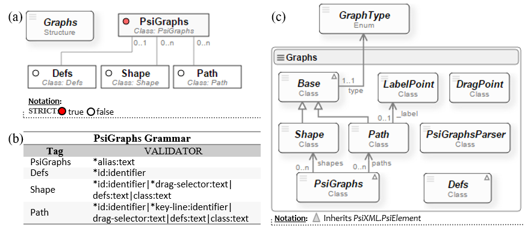

# Grapher
**Grapher** is a lightweight development environment for creating charts and graphs models based on projects and the use of *Graphs* and *Paint* components. It 
is web application's main purpose is to validate the functionality of our reusable components for creating charts and graphs models where his appearance and 
content depends on XML data sources.

## 1. Goal
The aim of this project is to look for how to create diagrams whose appearance and content depends on multiple heterogeneous XML and JSON information sources. 
Psi languages (view [PsiEngine](http://hilas.ii.uam.es/api)) natively offer the way to access and manipulate information by means of the *PsiLI* and *PsiCA* microlanguages.

In order to create diagrams we proposed two Psi languages: the **GraphsPsi** language responsible for defining graphics elements (figures and lines) and 
the **PaintPsi** language in charge of painting the diagram. The GraphsPsi language is implemented by the Graphs component and the PaintPsi language is implemented 
in the Paint component. The design and implementation of **Graphs** and **Paint** components are used the steps in the previous section.

## 2. Analysis and design
In Figure 4 we can see the different elements that take part in the serialization and rendering of a diagram: the *graphics library*, the *information source* and 
the *rendering process*. The aim for the graphics library is to define graphics element based on Scalable Vector Graphics (SVG). These elements are manageable, 
transformable and reusable. The information sources are XML and JSON files bound to the diagram and that affect its appearance and content. Finally, the rendering 
process creates the graphical representation of a diagram with SVG elements by using the graphics library and the information source.

The rendering of the diagram starts from the concept of *graphical definition*. In our framework, a graphical definition is the abstraction of a diagram from its 
graphical elements: **figures** and **lines**. A graphical element defines a SVG template. That is, a figure is the aggregation of SVG elements such as: rect, 
circle, ellipse, line, polyline, polygon, text, path, etc., while a line is an SVG element such as: line, polyline or path. In addition, in a graphical element 
we can specify what SVG elements (text, images and style) are modifiable and what SVG elements are involved in its behaviour (drag and drop, display, size and rotation) 
as it is shown in Figure 1.

 
**Figure 1**. Rendering figures based on the concept of graphical definition of elements and lines.

In Figure 1, the *Object* element consists of an image, a text and a circle. When an *Object* is instantiated the image and text of the element changes, and a style 
of Circle is given (fill and contour colours change). This modification comes from the XML or JSON information sources. In this context, "instantiate" a graphical 
element means to clone all SVG elements from the graphical library and locate it within a SVG canvas.

Moreover, the *Arrow* element in Figure 1 consists of setting the line type and the start and end markers. Like in the *Object* element, these kinds of elements can be 
modified by the information from XML or JSON sources.

As a consequence, to specify and render diagrams by associating information sources we propose to use two Psi components, namely: **Graphs** and **Paint**. The **Graphs** 
component implements the *GraphsPsi language*, which manages the graphics elements from the graphics library. For its part, the Paint component implements the *PaintPsi language*
in charge of managing the layout, with the possibility of binding XML and JSON information.

## 3. GraphsPsi Grammar
The *GraphsPsi language* manages the graphics elements from the graphics library by defining the next tags: **GraphsPsi**, **Defs**, **Shape** and **Path**. Following 
the steps mentioned at the beginning of this section, in Figure 2(a) we can see the [Psi Language Structure Diagram](http://hilas.ii.uam.es/api), and in la Figure 2(b) 
we can see the corresponding attribute validation. According to Figure 2(a), the **GraphsPsi** element root is the starting point for the *graphics library*. In addition 
it contains next tags:

-  **Defs** (optional) contains the SVG definitions such as symbols, tags, styles, etc. It has an identifier (*id* attribute) for each SVG definition so that they can be referenced by graphics elements.
-  **Shape** (optional, multiple) defines a figure by a set of graphics SVG elements (rect, circle, ellipse, line, polyline, polygon, text, path, etc.). It has an 
   identifier (*id* attribute) and a *drag-selector* attribute that delegates the movement of the figure to one more graphics elements. In addition, the attribute *defs* 
   lists the SVG definitions and the *class* attribute is used to give the CSS style the figure requires.
-  **Path** (optional, multiple): defines a line with one of the SVG tags: line, polyline or path. It has an identifier (*id* attribute) and *drag-selector* attribute to allow 
   the line to move. The *defs* and *class* attributes work similarly in the **Shape** tag.

 
**Figure 2**. (a) PsiLSD for the GraphsPsi language. (b) PsiGVA for the GraphsPsi grammar. (c) Class diagram for the Graphs component.
