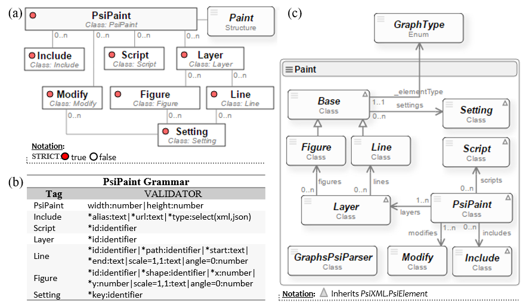
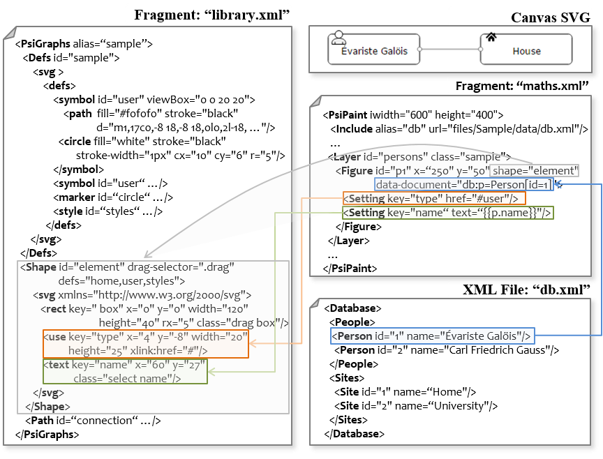

# Grapher
**Grapher** is a lightweight development environment for creating charts and graphs models based on projects and the use of *Graphs* and *Paint* components. It 
is web application's main purpose is to validate the functionality of our reusable components for creating charts and graphs models where his appearance and 
content depends on XML data sources.

## 1. Goal
The aim of this project is to look for how to create diagrams whose appearance and content depends on multiple heterogeneous XML and JSON information sources. 
Psi languages (view [PsiEngine](http://hilas.ii.uam.es/api)) natively offer the way to access and manipulate information by means of the *PsiLI* and *PsiCA* microlanguages.

In order to create diagrams we proposed two Psi languages: the **GraphsPsi** language responsible for defining graphics elements (figures and lines) and 
the **PaintPsi** language in charge of painting the diagram. The GraphsPsi language is implemented by the Graphs component and the PaintPsi language is implemented 
in the Paint component. The design and implementation of **Graphs** and **Paint** components are used the steps in the previous section.

## 2. Analysis and design
In Figure 4 we can see the different elements that take part in the serialization and rendering of a diagram: the *graphics library*, the *information source* and 
the *rendering process*. The aim for the graphics library is to define graphics element based on Scalable Vector Graphics (SVG). These elements are manageable, 
transformable and reusable. The information sources are XML and JSON files bound to the diagram and that affect its appearance and content. Finally, the rendering 
process creates the graphical representation of a diagram with SVG elements by using the graphics library and the information source.

The rendering of the diagram starts from the concept of *graphical definition*. In our framework, a graphical definition is the abstraction of a diagram from its 
graphical elements: **figures** and **lines**. A graphical element defines a SVG template. That is, a figure is the aggregation of SVG elements such as: rect, 
circle, ellipse, line, polyline, polygon, text, path, etc., while a line is an SVG element such as: line, polyline or path. In addition, in a graphical element 
we can specify what SVG elements (text, images and style) are modifiable and what SVG elements are involved in its behaviour (drag and drop, display, size and rotation) 
as it is shown in Figure 1.

<br>
**Figure 1**. Rendering figures based on the concept of graphical definition of elements and lines.

In Figure 1, the *Object* element consists of an image, a text and a circle. When an *Object* is instantiated the image and text of the element changes, and a style 
of Circle is given (fill and contour colours change). This modification comes from the XML or JSON information sources. In this context, "instantiate" a graphical 
element means to clone all SVG elements from the graphical library and locate it within a SVG canvas.

Moreover, the *Arrow* element in Figure 1 consists of setting the line type and the start and end markers. Like in the *Object* element, these kinds of elements can be 
modified by the information from XML or JSON sources.

As a consequence, to specify and render diagrams by associating information sources we propose to use two Psi components, namely: **Graphs** and **Paint**. The **Graphs** 
component implements the *GraphsPsi language*, which manages the graphics elements from the graphics library. For its part, the Paint component implements the *PaintPsi language*
in charge of managing the layout, with the possibility of binding XML and JSON information.

## 3. GraphsPsi Language and Graphs Component

### 3.1 GraphsPsi Language
The *GraphsPsi language* manages the graphics elements from the graphics library by defining the next tags: **GraphsPsi**, **Defs**, **Shape** and **Path**. Following 
the steps mentioned at the beginning of this section, in Figure 2(a) we can see the [Psi Language Structure Diagram](http://hilas.ii.uam.es/api), and in la Figure 2(b) 
we can see the corresponding attribute validation. According to Figure 2(a), the **GraphsPsi** element root is the starting point for the *graphics library*. In addition 
it contains next tags:

-  **Defs** (optional) contains the SVG definitions such as symbols, tags, styles, etc. It has an identifier (*id* attribute) for each SVG definition so that they can be referenced by graphics elements.
-  **Shape** (optional, multiple) defines a figure by a set of graphics SVG elements (rect, circle, ellipse, line, polyline, polygon, text, path, etc.). It has an 
   identifier (*id* attribute) and a *drag-selector* attribute that delegates the movement of the figure to one more graphics elements. In addition, the attribute *defs* 
   lists the SVG definitions and the *class* attribute is used to give the CSS style the figure requires.
-  **Path** (optional, multiple): defines a line with one of the SVG tags: line, polyline or path. It has an identifier (*id* attribute) and *drag-selector* attribute to allow 
   the line to move. The *defs* and *class* attributes work similarly in the **Shape** tag.

<br>
**Figure 2**. (a) PsiLSD for the GraphsPsi language. (b) PsiGVA for the GraphsPsi grammar. (c) Class diagram for the Graphs component.

The fragment xml code shows the template definition for each of the elements detailed in the GraphsPsi language.

```xml
<?xml version="1.0" encoding="utf-8"?>
<GraphsPsi alias="sample">
  <Defs id="…">
    <svg xmlns="http://www.w3.org/2000/svg" xmlns:xlink="http://www.w3.org/1999/xlink">
      <defs> <!-- SVG definitions --> </defs>
    </svg>    
  </Defs>
  <Shape id="…" drag-selector="…" defs="key1,key2,…">
    <svg xmlns="http://www.w3.org/2000/svg" xmlns:xlink="http://www.w3.org/1999/xlink">
      <!-- SVG graphics elements -->
    </svg>
  </Shape> ...
  <Path id="…" key-line="…" class="pert" defs="key1,key2,…" drag-selector="…">
    <svg xmlns="http://www.w3.org/2000/svg" xmlns:xlink="http://www.w3.org/1999/xlink">
      <!-- SVG graphics elements -->
    </svg>
  </Path> ...
</GraphsPsi>
```

### 3.2 Graphs Component
The **Graphs** component implements the functionality associated with *GraphsPsi language* and Figure 2(c) shows its class diagram. To simplify, the class associated 
to each tag has the same name, for example, the **Shape** tag has the *Shape* class and so on. It is noteworthy that the *GraphsPsi*, *Base* and *Defs* classes inherit 
from the abstract class *PsiElement* from [PsiXML](http://hilas.ii.uam.es/api).

When the Graphs component is initialized it creates three classifiers in the **PsiData**, namely: the "shape", "path" and "defs". The figures, lines and SVG definitions 
will be stored and made available for each of classifier.

Following Figure 2(c), *GraphsPsi* class manages the SVG definitions, the list of lines and the list of figures. *Defs* class register all SVG definitions in "defs" from 
**PsiData** with its identifiers. *Base* class manages the SVG document for the graphics element (shape or line), registers the instance in **PsiData**, creates the drag 
functionality by using the *drag-selector* attribute and binds the corresponding CSS style by using the *class* attribute. It also has the ability to clone the SVG elements 
to "instantiate" the graphics element. The *Shape* and *Path* classes inherit from the Base class allowing customizing the drag and drop, scale and rotation functionalities. 
The *DragPoint* class dynamically creates a point for the movement of the ends of a line, while the *LabelPoint* class creates a label for the line.

The detailed class diagram and the documentation for the **Graphs** component can be find [here](http://hilas.ii.uam.es/grapher/api).

## 4. PaintPsi Language and Paint Component

### 4.1 PaintPsi Language
The *PaintPsi language* aims to layout figures and lines basing on the GraphsPsi. To do so, it defines the following tags: **PaintPsi**, **Include**, **Script**, **Layer**, 
**Figure**, **Line**, **Setting** and **Modify**. Following the same steps used in previous subsection, Figure 3(a) shows the [structure diagram](http://hilas.ii.uam.es/api) 
for the *PaintPsi language*, and Figure 3(b) shows the validation attributes for the *PaintPsi grammar*. In Figure 3(a) the **PaintPsi** root tag specifies the width and height 
for the active SVG canvas. In addition it allows detail the next tags:

-  **Include** (optional, multiple): adds XML and JSON data with an alias in **PsiData** (in "document" and "json" classifiers respectively).
-  **Script** (optional, multiple): defines a script that is executed when the Psi program is evaluated.
-  **Layer** (optional, multiple): it defines the concept of graphics layer that contains figures, lines and scripts. The concept of graphics layer refers to the depth 
   for a group of elements, for example, if it is the background then it is defined at first label, but if it is in the foreground then it is defined at last label. 
   Next we list the children tags:

   * **Figure** (optional, multiple): it instances a figure based on an element from the *graphics library*. To do so, it has an identifier, the reference to the *Shape* 
     instance, the location coordinates *x* and *y*, the *scale* and the *angle*.
   * **Line** (optional, multiple): it instances a straight line based on a SVG line from the graphics library. It has an *identifier* attribute, a reference for a *Path* 
     instance, the coordinates for the starting and end points the end point, the scale and the angle.

-  **Modify**: it modifies a graphics element (**Line** or **Figure**) previously created by using a **Setting** tag.
-  **Setting** (optional, multiple): it defines and modifies SVG elements for both figures and lines. It has a *key* attribute that refers to the SVG element where changes 
   will be applied.

<br>
**Figure 3**. (a) PsiLSD for the PaintPsi language. (b) PsiGVA for the PaintPsi grammar. (c) Class diagram for the Paint component.

The fragment xml code shows the template for each element from the PaintPsi language.

```xml
<?xml version="1.0" encoding="utf-8"?>
<PaintPsi xmlns:xlink="http://www.w3.org/1999/xlink" width="…" height="…">
  <Include alias="…" url="…" type="…"/> ...
  <Layer id="…" class="…">
    <Figure id="…" x="x" y="y" shape="…" data-document="…" scale="…" angle="…">
      <Setting key="…" …="…" …/> ...
    </Figure> ...
    <Line id="…" path="…" start="x1,y1" end="x2,y2" scale="…" angle="…">
      <Setting key="…" …="…" …="…"/> ...
    </Line> ...
    <Script id="…"><!-- Script definition --></Script> ...
  </Layer> ...
  <Script id="…"><!-- Script definition --></Script> ...
</PaintPsi>
```

### 4.2 Paint Component
The **Paint** component implements the functionality associated with the *PaintPsi language*, as shown in the class diagram of Figure 3(c). As in the **Graphs** component, 
the class associated with each tag has the same name, that is, the **PaintPsi** tag is related to the *PaintPsi* class, the **Include** tag is related to the *Include* class, 
and so on.

The *PaintPsi* root class manages the graphics layers, the inclusions and the scripts. It initializes the context and adds all the available layers to the active SVG canvas.
The *Include* class is responsible for fetching and registering XML documents and JSON objects into PsiData. The *Script* class registers scripts, which are used to add 
dynamism to the diagram and, once evaluated, are available three environment variables: the active SVG canvas, the PsiData, and current elements graphics.

The *Layer* class aims to create and manage the graphics layer. It uses the SVG g tag as grouper and adds it to the active canvas with an identifier and a CSS class. Furthermore, 
it paints the list of figures and list lines.

The *Base* class implements the painting process for both figures and lines. To do so, it uses the reference for the graphics definition (graph or path attributes respectively) and 
creates an instance (line or figure respectively). In addition, the *Base* class implements the functionality to resize, rotate and change the configuration of SVG elements 
of a graphics element through instances of *Setting*. The *Setting* class seeks SVG element by using the key attribute and performs configuration changes.

The *Figure* class inherits from the Base class and aims to paint a picture. It implements the functionality to move the figure to a new position and to report on its size 
(width and height). The *Line* class inherits from the Base class too and aims to paint a straight line. It implements the ability to move the starting and end points. 
To implement polylines or Bessel curves it is necessary typify the Line class and add corresponding behaviour of each one.

The class diagram and detailed documentation for the Paint component can be find [here](http://hilas.ii.uam.es/grapher/api).

## 5. Example using the GraphsPsi and PaintPsi languages
Figure 4 shows a snippet of the graphics library in *GraphsPsi* language ("library.xml" file) and a fragment of a *PaintPsi* code diagram (file "maths.xml"). This example 
highlights the bindings of *GraphsPsi* and *PaintPsi* languages with XML information (file "db.xml"). This example is available in the "Sample" project of the Grapher 
application (see next section).

The "library.xml" fragment provides the following elements: Defs (Symbols id = "home" and id="user"; Markers id="circle"; Styles id="styles"), Shapes (id="element") and 
Paths (id="connection").

The "maths.xml" fragment Figure 4 loads the XML file (with url="files/Sample/data/db.xml") and makes it available with the alias db. It can be seen that the Figure with 
id="p1" is moved to the position (250,50) and has the reference to the Shape graphic element with id="element". In addition, with the use of the PsiLI microlanguage the 
node Person with id="1" (attribute data-document) from file "db.xml" is associated. To get the name "Evariste Galöis" we use the PsiCA microlanguage and extract it from 
the XML file through the Setting tag (text="{{p.name}}"). This name is added as text in the SVG text label. The symbol used to figure id="p1" is the "user" (href="# user"). 
The visual effect of this sequence can be seen in Figure 4.

<br>
**Figure 4**. Binding GraphsPsi and PaintPsi with XML information.

## 6. 4.5	Grapher Web Application
Once implemented the **Graphs** and **Paint** reusable components, we have developed the web application we have called **Grapher**. This application is a lightweight development 
environment for creating diagrams and graphs models. It is based on projects, the edition of XML files and the use of the **Paint** and **Graphs** components.

In Figure 5, we can see a **Grapher** snapshot where we can identify two sections: Project and Psi Diagram. A project is a set of graphics libraries (files GraphsPsi), 
layout (PaintPsi files), XML data sources (XML files) and JSON data sources (JSON files). The Psi Diagram is a SVG canvas where the layouts files will be evaluated. 
The Grapher main features are described below:

-  **Project Menu**: it creates, opens or closes a project. Create a project involves creating a directory on the server with the alias of the project, and inside this 
   directory three additional subdirectories, namely: graphs (to host GraphsPsi files), paints (to host PaintPsi files) and data (to hosts XML and JSON data files). Open 
   a project means to bring the directory structure and manage it in the Project section. Each subdirectory is shown in the corresponding tab (Graphs Psi, Paint Psi and Data). 
   Delete a project involves removing the directory from the server. In addition, there are debugging tools, and features to allow cleaning the diagram, seeing the SVG 
   generated code and displaying the PaintPsi source code.
-  **GraphsPsi Editor**: it edits GraphsPsi source code file from the active project. The editor provides autocompletion tools for the *GraphsPsi grammar*. When evaluating a 
   GraphsPsi file, the graphic elements are available in PsiData and the number of executions is increased and highlighted in green.
-  **PaintPsi Editor**: it edits PaintPsi source code file from the active project. In the same way the GraphsPsi Editor, it has autocompleting features for the *PaintPsi grammar*. 
   When evaluating a PaintPsi file, its layout is built on the SVG canvas from the Psi Diagram section and the number of executions is increased and highlighted in green. 
   It must be notice that if the same program is evaluated twice, the graphic elements change but no more are added.
-  **XML Editor**: it edits XML data files (*.xml).
-  **JSON Editor**: it edits JSON data files (*.json).

<br>
**Figure 5**. *Grapher*: lightweight development environment for the use Graphs and Paint components.

## 7. Installation
Create a website and copy all files. The file "index.html" running **Grapher Web Application**. The file "api.html" is documentation the **Graphs** and **Paint** component. 

